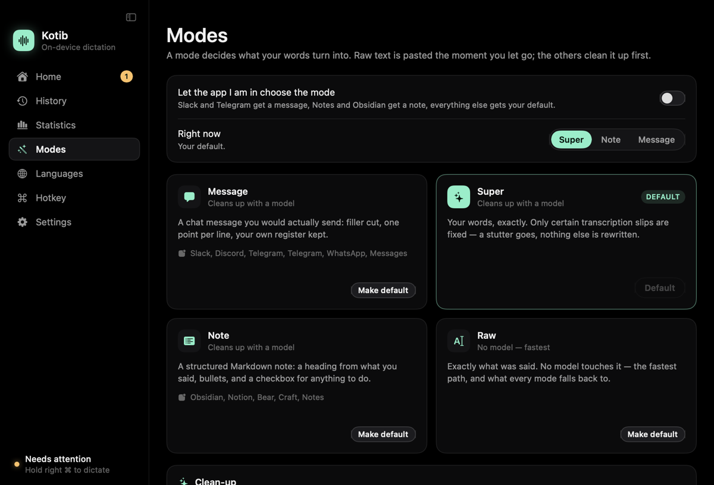
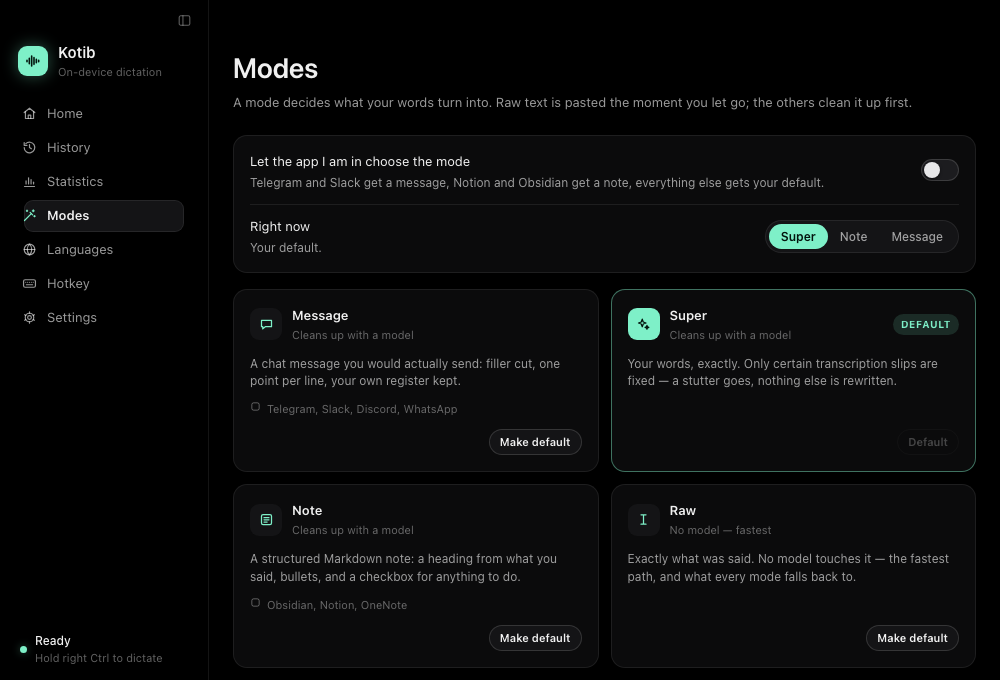
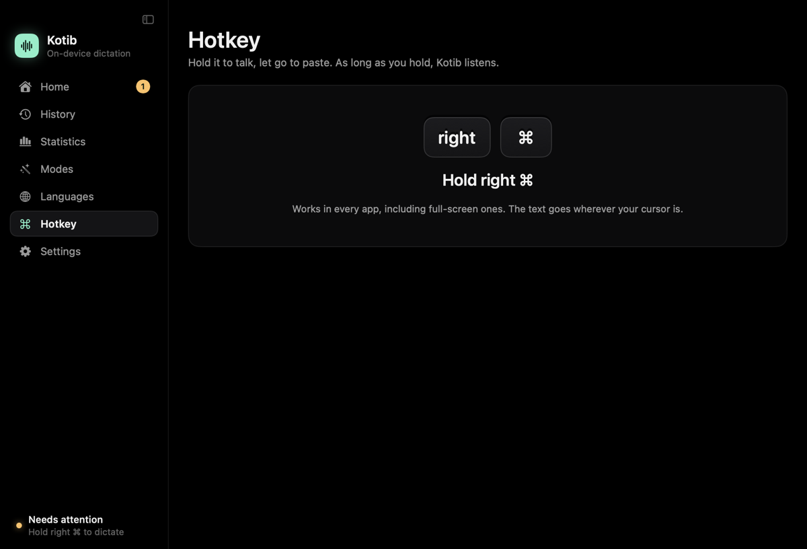
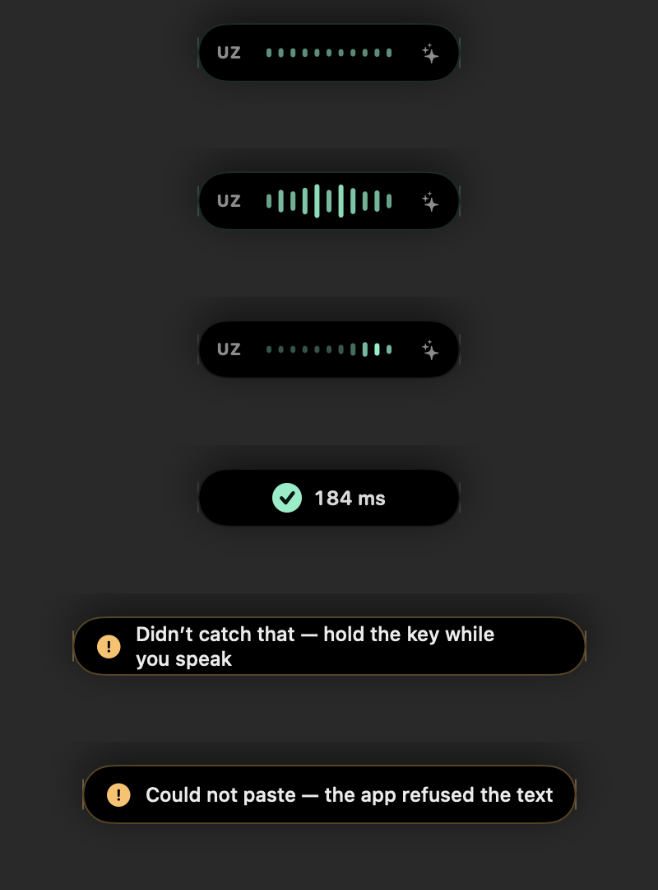

# Kotiba

Hold a key, talk, let go, and the text appears wherever your cursor is. English, Russian and
Uzbek, transcribed **entirely on your own computer**. For macOS and Windows. Free and open source (MIT).

*Kotiba* (котиба) is Uzbek for "secretary". Uzbek is the reason this exists: almost no
mainstream dictation tool transcribes it usably. Until 1.0 the app was called Kotib; an existing
install's settings, history and models move over on the first launch of Kotiba
([docs/SETUP.md](docs/SETUP.md#upgrading-from-kotib)).

> **Not affiliated with KotibAI (kotib.ai).** The Uzbek speech model is
> [`Kotib/uzbek_stt_v1`](https://huggingface.co/Kotib/uzbek_stt_v1) by the Kotibai & Rubai team,
> used under Apache-2.0. This app is an independent, unofficial client. See [Credits](#credits).

| | |
|---|---|
|  |  |
|  |  |

*(Screenshots are rendered from the app's own views with sample data, so counters and timings in
them are placeholders, not measurements.)*

## What it does

- **Hold to talk.** Hold a key (right ⌘ on macOS, right Ctrl on Windows; you can change it),
  speak for as long as you like, release, and the text is pasted. A small black pill with a
  live waveform shows that it is listening.
- **Three languages, all on-device.** English and Russian use one model (Parakeet Ultra); Uzbek
  uses a fine-tuned Whisper model. Nothing is sent to a server to be transcribed.
- **Turkish and Arabic, optional.** Off until you turn them on in Languages, and nothing of
  theirs is downloaded until then: Turkish runs on Whisper large-v3-turbo (574 MB), Arabic on
  Cohere Transcribe Arabic (with punctuation) with turbo and its own modes model, Gemma 4 E2B
  (5.45 GB together). Each is
  recognised automatically (Turkish in dictations of 5 s or more) or can be pinned. In testing,
  0 of 1,607 Uzbek recordings were taken for Turkish.
- **Punctuation and capitals** come out right in all three languages.
- **Three modes, plus Raw.** *Super* keeps your words and fixes only clear slips (stutters,
  fillers, punctuation). *Message* turns speech into a chat message. *Note* makes a short
  Markdown note. *Raw* is exactly what was said. The modes run on a small on-device language
  model (Qwen3-1.7B), and the app can pick the mode from the app you are typing in.
- **Ducking.** While you hold the key, only audio that is currently playing is lowered, and it is
  restored on release.
- **Always on.** Optionally keeps a menu-bar / tray icon running through quits, crashes and
  restarts.

## How fast

Every figure below is a measurement on **one Apple M4 Pro, 24 GB, macOS 26.5**, with other
programs running (the measurement notes give the load for each run). They are not promises for
your machine, and **nothing has been measured on Windows hardware yet**.

- **English and Russian speech recognition (Parakeet Ultra, macOS, model already loaded):**
  41 ms for 3 s of audio, 54–62 ms for 10 s, 139–145 ms for 30 s, 202–232 ms for 60 s.
- **Time from releasing the key to the recognised text, for long dictations** (30 s to 190 s,
  18 clips, audio fed at real-time pace so most of it is decoded while the key is still held):
  31–178 ms, median about 80 ms. This is recognition only. Pasting is not included.
- **Modes, after key release (macOS, GPU not shared with anything else):** about 50–90 ms
  median and 160–250 ms at the 90th percentile once the pipeline streams. Super in English and
  Russian adds 0 ms because no model is asked. If something else is using the GPU, the 90th
  percentile rises to roughly 450–530 ms for Note and for Message in Uzbek.
- **Key release to text inserted, whole app (macOS, recorded speech replayed in real time):**
  English and Russian in Raw and Super, 128 of 128 dictations within 200 ms (median 6–97 ms).
  Message and Note, median 52–241 ms. Uzbek, median 209–375 ms and up to about 2 s (Raw, after
  P2: 196–296 ms, up to about 1.6 s), which is above the 200 ms target. Unpinned, 62 of 64 Uzbek
  dictations reached the Uzbek engine and 0 of 64 English and Russian ones did.
- **Turkish and Arabic (optional), key release to text, macOS, released 300 ms after the last
  word:** Turkish median 360 ms (90th percentile 755 ms, 40 FLEURS clips), above the 200 ms
  target; Arabic median 274 ms (20 clips). Word error rate on FLEURS: Turkish 7.2 %, Arabic 7.0 %.
- **Accuracy (FLEURS, 200 utterances per language, word error rate):** English 6.1 %,
  Russian 7.1 % for Parakeet Ultra. On the same sets Apple's built-in English recogniser scored
  8.8 % and Whisper large-v3-turbo scored 6.2 % (English) and 7.3 % (Russian).
- **Windows** runs the same Parakeet weights (int8, ONNX Runtime, CPU): 5.8 % English and 7.3 %
  Russian, measured on the Mac's CPU. Windows latency is not yet measured.
- **Uzbek** is much harder than English or Russian. Public Uzbek benchmarks understate
  real-world error: on real, noisy recordings expect roughly one word in five to need correcting.

The full methods, sets and caveats are in the project's measurement notes (P1/P2: the whole
pipeline and Uzbek; C1: English and Russian engine choice; C3: on-device modes; C4: Turkish and
Arabic), which are kept in the development repository rather than here.

## Install

Kotiba is **not notarised by Apple and not signed by Microsoft**, because that costs money per
year and this is a free project. Both operating systems will therefore warn you the first time.
The warnings are about the missing paid signature, not about anything found in the app; the
source is here to read and to build yourself.

### macOS (Apple Silicon, macOS 26 or newer)

1. Download `Kotiba-<version>.dmg` from the [Releases](../../releases) page and drag **Kotiba**
   into **Applications**. The build is signed *ad hoc* (no Apple certificate, no Apple ID). (Downloading with `curl -L -o Kotiba.dmg <link>` instead of a browser
   avoids the warning entirely, because only the downloading app tags a file as quarantined.)
2. Open it. macOS will refuse: *"could not verify that Kotiba is free of malware"*.
   **Do not click "Move to Trash".** Click **Done**, then open **System Settings › Privacy &
   Security**, scroll down, and click **Open Anyway** next to Kotiba. Once only.
   On macOS 14 and older, right-click the app › **Open** › **Open** does the same.
3. Or, in one line, clear the block yourself:
   ```
   xattr -dr com.apple.quarantine /Applications/Kotiba.app
   ```
4. Grant the two permissions below. **After each update grant them again** (remove Kotiba from
   both lists and add it back): macOS keys them to an ad-hoc app's code hash, which every new
   version changes.

### Windows (64-bit)

Download `Kotiba-Setup-<version>.exe` from [Releases](../../releases) and run it. SmartScreen
will say *"Windows protected your PC"*: click **More info › Run anyway**. The installer is large
(about 1.2 GB) because the models are inside it. **The Windows build has not yet been tested on
real Windows hardware** — only under Wine and in unit tests; reports are welcome.

## Permissions

**macOS needs three, and only one of them is asked for automatically.**

| Permission | Why | How |
|---|---|---|
| Microphone | To hear you | macOS asks; say yes |
| **Input Monitoring** | To notice you holding the hotkey in any app | **Grant by hand** |
| **Accessibility** | To paste into the app you are using | **Grant by hand** |

For the two manual ones, open **System Settings › Privacy & Security › Input Monitoring** (and
then **Accessibility**), click **+**, choose `/Applications/Kotiba.app`, and switch it on. If you
skip them the app can hear you but the hotkey does nothing, or the text is never pasted. The
first-run setup and **Settings › Permissions** show what is still missing and open the right pane.

Kotiba is deliberately not sandboxed (Accessibility and Input Monitoring do not work inside the
App Store sandbox), so it will not be an App Store app.

On Windows the microphone is the permission to grant; the hotkey and paste need nothing else.

## First run and downloads

| Model | Used for | Size | Where it comes from |
|---|---|---|---|
| `Kotib/uzbek_stt_v1`, converted to ggml q5_0 | Uzbek | 539 MB | inside the release installers; from source, see below |
| Silero VAD v6.2 (ggml) | finding pauses, so text is ready when you let go | 885 KB | inside the installers |
| Whisper base q5_1 | language detection | 60 MB | inside the installers |
| Parakeet Ultra (Core ML on macOS, ONNX int8 on Windows) | English and Russian | 632 MB on macOS, 668 MB on Windows | downloaded automatically after setup |
| Qwen3-1.7B Q4_K_M | Modes (Super, Message, Note) | 1.28 GB | downloaded automatically after setup |
| Whisper large-v3-turbo q5_0 | Turkish; Arabic's language check and fallback | 574 MB | only when Turkish or Arabic is turned on |
| Cohere Transcribe Arabic 07-2026 | Arabic | 1.77 GB | only when Arabic is turned on |
| Gemma 4 E2B Q4_K_M | Arabic's modes | 3.11 GB | only when Arabic is turned on |

The first five are the core every user gets, with nothing to choose. The installers carry the
first three (GitHub caps a release file at 2 GiB, so the core cannot all ride in one), and as
soon as setup is finished — or skipped — Kotiba fetches the rest by itself, shown as one
"Getting Kotiba ready — 1.9 GB" card on Home. Dictation works meanwhile: Uzbek at once, English
on Apple's built-in recogniser on a Mac, and the modes tidy fillers and punctuation without a
model; Russian (and on Windows English) waits for Parakeet, saying how far it has got. Turning
Turkish or Arabic on shows its size under the switch and downloads everything it needs; turning
it off offers to delete those files. Each file is checked against a sha256 pinned in
`Scripts/Manifest.json` (or the bundle catalogue), and an interrupted download continues where
it stopped, at the next launch if need be. `make dmg MODELS=1` builds an image with the whole
core inside, for a machine that should download nothing; `make bootstrap` fetches everything
for a source build. Models are never committed to this repository.

## Privacy

Recognition, punctuation and all three modes run on your machine. **Nothing you say leaves the
device unless you turn on the optional "cloud polish" setting** (off by default), which sends
the recognised *text* (never audio) to an OpenAI-compatible endpoint that you name, with a key
you supply and that is stored in the Keychain / Credential Manager. Downloading a model contacts
Hugging Face. Diagnostics record timings and outcomes, never the words. History is a local file
you can turn off or delete in Settings.

## Build from source

macOS: Xcode 26.2 or newer (Swift 6.2) and [XcodeGen](https://github.com/yonaskolb/XcodeGen).

```
make doctor       # check the toolchain
make bootstrap    # download the models and verify their sha256
make generate     # generate Kotiba.xcodeproj from project.yml
make build        # swift build
make test         # unit tests: no signing, no models, no microphone
make lint
make app          # Release KotibaMac.app in build/xcode  (needs a Team ID, see below)
```

**Set your own Apple Team ID.** Signing needs one and none is in the repository. Put
`DEVELOPMENT_TEAM = ABCDE12345` (your ten-character ID from Xcode › Settings › Accounts; a free
personal team works) in `Config/Local.xcconfig`, which git ignores, or once in
`~/.config/kotiba/Local.xcconfig` and `make generate` copies it in. `make build` and `make test`
do not sign, so they need no Team ID. Details are in [docs/SETUP.md](docs/SETUP.md).

The Uzbek model has no ready-made ggml file upstream, so this project publishes its conversion
as release [`models-v2`](https://github.com/aziznizomofficial/kotiba/releases/tag/models-v2), and `make bootstrap` fetches it from
there (sha256-checked). It is converted from `Kotib/uzbek_stt_v1` with whisper.cpp's
`convert-h5-to-ggml.py` and quantised to q5_0; `Scripts/convert-uzbek.sh` reproduces the file
byte for byte.

**No Apple account at all?** `make dmg ADHOC=1` builds the same ad-hoc-signed image as the
release (no Team ID needed; it embeds the models from `~/Library/Application Support/Kotiba/models`,
so run `make bootstrap` first).

Windows: `cd windows && npm ci && npm run gate` (typecheck, lint, tests). See
[windows/README.md](windows/README.md) for the installer.

## Recovery from GitHub alone

```bash
git clone https://github.com/aziznizomofficial/kotiba.git
cd kotiba && make doctor && make bootstrap && make generate && make build
```

That is a complete rebuild of the macOS app from a bare clone plus network. `make bootstrap` is
the only step that touches the network: models are not committed, and it checks each sha256
against `Scripts/Manifest.json`, so a model that disappears upstream can be replaced by a file
with the same hash. No API keys are involved. For a signed app add your Team ID as described
above. For Windows: `cd windows && npm ci && npm run gate`.

## Architecture in one paragraph

`KotibaCore` is pure Swift with no AVFoundation, Core ML or SwiftUI; everything
platform-shaped enters through protocols in `Contracts.swift`, and `make lint` enforces it, which
is what lets most tests run in milliseconds. Below it sit `KotibaAudio`, `KotibaEngines`,
`KotibaModels`, `KotibaPlatform` and `KotibaUI`, with thin app shells in `Apps/`. The Windows port
(Electron and TypeScript, plus a small C++ transcriber) lives in `windows/`. See
[docs/10-ARCHITECTURE.md](docs/10-ARCHITECTURE.md).

## Credits

Kotiba stands on other people's work; the full notices are in
[THIRD_PARTY_NOTICES.md](THIRD_PARTY_NOTICES.md) and are also shown in the app under
**Settings › About**.

- **Uzbek:** [`Kotib/uzbek_stt_v1`](https://huggingface.co/Kotib/uzbek_stt_v1) by the
  **Kotibai & Rubai team**, a fine-tune of OpenAI Whisper medium, **Apache-2.0**. Kotiba converts
  it to ggml and quantises it to q5_0, which is a modification. Kotiba is not affiliated with
  KotibAI (kotib.ai).
- **English and Russian:** *Parakeet Ultra* is moondream's post-training of NVIDIA
  [`parakeet-tdt-0.6b-v3`](https://huggingface.co/nvidia/parakeet-tdt-0.6b-v3), licensed
  **[CC BY 4.0](https://creativecommons.org/licenses/by/4.0/)**. Used here in a Core ML build by
  FluidInference ([`parakeet-ultra-coreml`](https://huggingface.co/FluidInference/parakeet-ultra-coreml))
  and an ONNX int8 export by Olicorne. Changes were made to the original by those parties.
- **Modes:** [Qwen3-1.7B](https://huggingface.co/ggml-org/Qwen3-1.7B-GGUF) (Apache-2.0).
- **Language detection:** OpenAI Whisper base (MIT).
- **Libraries:** [whisper.cpp](https://github.com/ggml-org/whisper.cpp) and
  [llama.cpp](https://github.com/ggml-org/llama.cpp) (MIT),
  [FluidAudio](https://github.com/FluidInference/FluidAudio) (Apache-2.0), ONNX Runtime,
  node-llama-cpp and Electron (MIT). The Uzbek text normaliser is a port of NavAI's
  [`uzbek_text_norm`](https://github.com/NavAI-pro/uzbek-text-norm) (MIT). One test clip is from
  [OvozifyLabs/asr_evaluate_set](https://huggingface.co/datasets/OvozifyLabs/asr_evaluate_set)
  (Apache-2.0).

## Contributing

See [CONTRIBUTING.md](CONTRIBUTING.md).

## Licence

Kotiba's own code is [MIT](LICENSE), Copyright (c) 2026 Aziz Nizom. Models and third-party
components keep their own licences, listed in [THIRD_PARTY_NOTICES.md](THIRD_PARTY_NOTICES.md).
